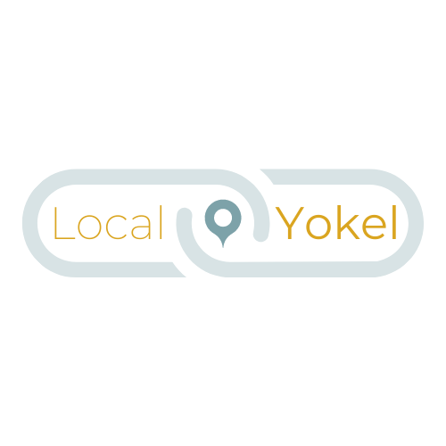

# Local Yokel

### Local Yokel is an application for your local community!

Everyone is welcome to use it, but it is primarily built for communities that seek to consolidate information about their small business offerings. Users experience the ability to seek out small businesses applicable to their needs and interests, save them for future access, and keep a personalized data log of information about those saved businesses. 

Small businesses have the freedom to log into their own accounts and update their information as needed. Have a sale coming up? Tell us about it! Did you recently develop a new website for your business? Share the link!

This app is intended to connect people with their local community of small businesses in a way that larger apps have a difficult time providing. It cuts out all of the excess, those big brand, find-it-everywhere locations, and gives direct access to your local favorites.

__Goals__

1. _I am seeking to provide a user experience to both the customer and business owner looking to connect with each other more readily._
2. _I would like to learn to utilize the planning stages to develop my application before it is built, rather than simply a means for brainstorming._
3. _I am very interested in establishing a better understanding of design and how it relates to functionality._
4. _I would like to develop a higher level of confidence in my grasp of the material we have learned in class so far._

↓↓ Default React ReadMe Info ↓↓
This project was bootstrapped with [Create React App](https://github.com/facebook/create-react-app).

## Available Scripts

In the project directory, you can run:

### `npm start`

Runs the app in the development mode. 
Open [http://localhost:3000](http://localhost:3000) to view it in the browser.

The page will reload if you make edits. 
You will also see any lint errors in the console.

### `npm test`

Launches the test runner in the interactive watch mode. 
See the section about [running tests](https://facebook.github.io/create-react-app/docs/running-tests) for more information.

### `npm run build`

Builds the app for production to the `build` folder. 
It correctly bundles React in production mode and optimizes the build for the best performance.

The build is minified and the filenames include the hashes. 
Your app is ready to be deployed!

See the section about [deployment](https://facebook.github.io/create-react-app/docs/deployment) for more information.

### `npm run eject`

**Note: this is a one-way operation. Once you `eject`, you can’t go back!**

If you aren’t satisfied with the build tool and configuration choices, you can `eject` at any time. This command will remove the single build dependency from your project.

Instead, it will copy all the configuration files and the transitive dependencies (webpack, Babel, ESLint, etc) right into your project so you have full control over them. All of the commands except `eject` will still work, but they will point to the copied scripts so you can tweak them. At this point you’re on your own.

You don’t have to ever use `eject`. The curated feature set is suitable for small and middle deployments, and you shouldn’t feel obligated to use this feature. However we understand that this tool wouldn’t be useful if you couldn’t customize it when you are ready for it.

## Learn More

You can learn more in the [Create React App documentation](https://facebook.github.io/create-react-app/docs/getting-started).

To learn React, check out the [React documentation](https://reactjs.org/).

### Code Splitting

This section has moved here: https://facebook.github.io/create-react-app/docs/code-splitting

### Analyzing the Bundle Size

This section has moved here: https://facebook.github.io/create-react-app/docs/analyzing-the-bundle-size

### Making a Progressive Web App

This section has moved here: https://facebook.github.io/create-react-app/docs/making-a-progressive-web-app

### Advanced Configuration

This section has moved here: https://facebook.github.io/create-react-app/docs/advanced-configuration

### Deployment

This section has moved here: https://facebook.github.io/create-react-app/docs/deployment

### `npm run build` fails to minify

This section has moved here: https://facebook.github.io/create-react-app/docs/troubleshooting#npm-run-build-fails-to-minify
